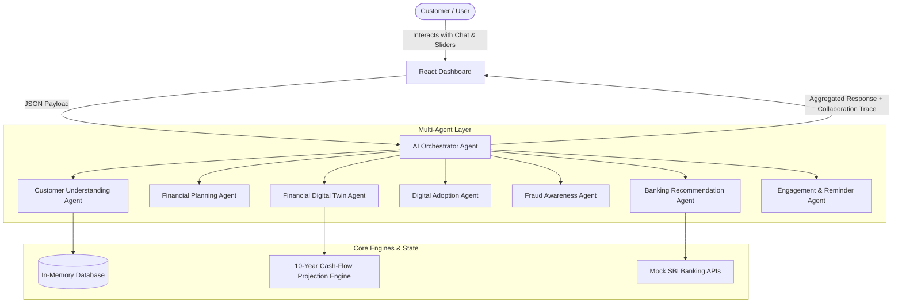

# 🚀 SBI NEXUS — Agentic AI Digital Banking Companion

> **Empowering SBI Customers with Proactive, Collaborative Multi-Agent Intelligence**

---

## 📌 Project Overview
* **Theme**: Agentic AI & Emerging Tech
* **Competition / Hackathon**: SBI Hackathon @ Global FinTech Fest (GFF) 2026
* **Target Audience**: SBI retail banking customers, particularly those seeking to transition into the digital ecosystem (YONO, UPI, AutoPay) or model long-term financial milestones.

---

## ⚠️ Problem Statement
Traditional mobile banking applications are primarily **reactive**—they wait for users to check balances, make transfers, or search for products. This creates several key issues:
* **Digital Adoption Gaps**: Tech-shy or elderly customers find feature-dense apps like SBI YONO or UPI setups intimidating, leading to slow digital onboarding.
* **Lack of Scenario Planning**: Customers do not have an intuitive way to simulate financial decisions (e.g., *"How does increasing my SIP by ₹2,000 affect my home loan timeline?"*).
* **Static Security Measures**: Fraud prevention is often retrospective, relying on users recognizing fraud after the transaction occurs.
* **Generic Recommendations**: Standard banner ads fail to provide hyper-personalized, context-aware suggestions mapped to a customer's real-time cash flow.

---

## 💡 Proposed Solution: SBI NEXUS
**SBI NEXUS** is a next-generation **Agentic AI Digital Banking Companion** that acts as an intelligent assistant, coach, and guardian. Built on a **collaborative multi-agent framework**, it coordinates specialized AI agents to guide, educate, and protect the customer.

By simulating a **Financial Digital Twin**, SBI NEXUS models cash-flow scenarios in real-time, gamifies the onboarding of digital banking tools (YONO, UPI, AutoPay), and maintains a proactive **Fraud Guard** security shield.

---

## ⚙️ Process Flow & Architecture
SBI NEXUS processes user queries and actions through a orchestrated multi-agent network:



### Process Execution Sequence:
1. **User Action**: The user asks a financial question or adjusts cash-flow sliders in the React frontend dashboard.
2. **Orchestration**: The **AI Orchestrator** parses the query and decides which specialized agents need to collaborate.
3. **Collaboration**:
   * The **Customer Agent** looks up user transaction history.
   * The **Digital Twin Agent** calculates future projections.
   * The **Recommendation Agent** matches results with active SBI products.
4. **Trace Output**: The response, along with a transparent **Collaboration Trace** showing each agent's internal reasoning, is returned to the dashboard.

---

## 🛠️ Technology Stack

| Layer | Technology | Purpose |
| :--- | :--- | :--- |
| **Frontend** | **React.js (Vite)** | Responsive single-page application dashboard |
| **Styling** | **Tailwind CSS** | Premium Glassmorphism UI & responsive layouts |
| **Visualizations** | **Recharts** | Interactive 10-year cash-flow forecasting graphs |
| **Icons** | **Lucide-react** | Clean modern iconography |
| **Backend API** | **FastAPI (Python 3.10+)** | High-performance asynchronous API endpoints |
| **Data Validation** | **Pydantic** | Strict request-response data modeling |
| **Containerization** | **Docker & Compose** | Unified multi-container deployment |

---

## 📂 Project Folders Hierarchy

```
SBI-NEXUS/
├── backend/
│   ├── app/
│   │   ├── agents/            # Collaborative Multi-Agent Layer
│   │   │   ├── adoption_agent.py      # Guides YONO/UPI/AutoPay activation
│   │   │   ├── customer_agent.py      # Analyzes spending patterns & profile
│   │   │   ├── digital_twin.py        # Projecting cash flows & targets
│   │   │   ├── engagement_agent.py    # Formulates reminders & alerts
│   │   │   ├── fraud_agent.py         # Monitors security & freeze commands
│   │   │   ├── orchestrator.py        # Central agent router & coordinator
│   │   │   ├── planning_agent.py      # Goal roadmap strategist
│   │   │   └── recommend_agent.py     # Maps SBI financial products to goals
│   │   ├── api/               # Endpoint Routing
│   │   │   └── sbi_mock_api.py        # Mocks YONO and SBI Core banking APIs
│   │   ├── database.py        # In-memory State Store & Mock Data
│   │   └── main.py            # FastAPI Application Entrypoint
│   ├── Dockerfile
│   └── requirements.txt
├── frontend/
│   ├── src/
│   │   ├── components/        # Interactive Dashboard Modules
│   │   │   ├── AlertBanner.jsx       # Emergency alerts and suggestions
│   │   │   ├── ChatBot.jsx          # Agent chat interface + Trace Viewer
│   │   │   ├── DigitalTwin.jsx      # Financial Twin Sandbox & Recharts
│   │   │   ├── FraudGuard.jsx       # Security cockpit and panic lock
│   │   │   └── OnboardingGuide.jsx  # Smartphone simulator for YONO tutorial
│   │   ├── App.jsx            # Core Dashboard Layout & Component Shell
│   │   ├── index.css          # Design system variables & styling tokens
│   │   └── main.jsx           # React app mountpoint
│   ├── index.html
│   ├── tailwind.config.js
│   ├── vite.config.js
│   └── Dockerfile
├── docker-compose.yml         # Local container orchestration config
├── LICENSE                    # Project license guidelines
└── README.md                  # This file
```

---

## 🌟 Key Features

1. **Multi-Agent Collaboration Trace**:
   Every time the user asks a question, the dashboard reveals a detailed step-by-step trace showing exactly how the **Customer**, **Planning**, and **Recommendation** agents worked together to formulate the answer.
2. **Financial Digital Twin Sandbox**:
   An interactive space with sliders allowing the customer to simulate budget changes (e.g., cutting down discretionary spending, increasing monthly Mutual Fund SIPs) and instantly view 10-year projected cash-flow graphs for goal completion.
3. **Interactive Onboarding Emulator**:
   A visual, step-by-step mock smartphone simulation that walks non-digital users through setting up UPI, activating the SBI YONO app, and establishing recurring AutoPay instructions safely.
4. **Autonomous Fraud Guard**:
   An active security cockpit that highlights suspicious transactions (e.g. overseas merchant attempts) and provides a single-click "Freeze Account" panic button to lock digital banking channels instantly.
5. **Contextual Engagement Notifications**:
   Pushes helpful, real-time alerts regarding salary credits, fixed deposit maturities, and target budget limits directly to the user dashboard.

---

## 👥 Team & Roles

* **Atharv Pawar** — *Lead Developer & AI Architect*
  * Designed the FastAPI backend and orchestrator routing model.
  * Developed the multi-agent collaboration backend logic.
  * Implemented the React dashboard, featuring the interactive Smartphone Emulator and Recharts projection dashboard.

---

## 🚀 Getting Started

Ensure you have **Python 3.10+** and **Node.js 18+** installed on your machine.

### Method 1: Local Development Setup

#### 1. Clone & Navigate to Workspace
```bash
git clone https://github.com/Atharv-Pawar/SBI-NEXUS.git
cd SBI-NEXUS
```

#### 2. Start the FastAPI Backend Service
```bash
cd backend
python -m venv venv

# Activate Virtual Environment (Windows)
venv\Scripts\activate

# Activate Virtual Environment (macOS/Linux)
source venv/bin/activate

pip install -r requirements.txt
python app/main.py
```
The FastAPI backend service will start running on [http://localhost:8000](http://localhost:8000).

#### 3. Start the Vite React Frontend
Open a new terminal session, navigate to the `frontend` folder, and run:
```bash
cd frontend
npm install
npm run dev
```
Open your browser and navigate to [http://localhost:5173](http://localhost:5173) to view the companion.

---

### Method 2: Docker Compose Setup

Run the entire stack (backend + frontend) in a single command using Docker:
```bash
docker-compose up --build
```
* **Frontend**: [http://localhost:5173](http://localhost:5173)
* **Backend API Docs**: [http://localhost:8000/docs](http://localhost:8000/docs)

---

## 📄 License
Distributed under the MIT License. See the [LICENSE](./LICENSE) file for more details.
