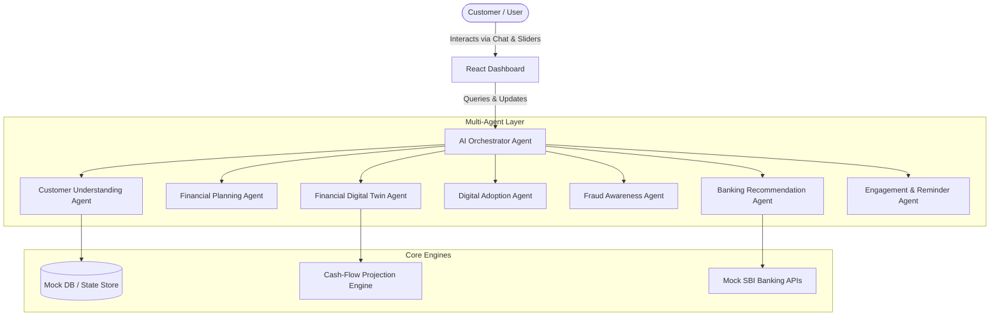

# 🚀 SBI NEXUS - Agentic AI Digital Banking Companion

**SBI NEXUS** is an Agentic AI-powered financial companion designed to accelerate the adoption of SBI's digital banking ecosystem. Developed for the **SBI Hackathon @ Global FinTech Fest (GFF) 2026** under the theme **Agentic AI & Emerging Tech**.

Unlike traditional chatbots that only respond to queries reactively, SBI NEXUS utilizes a collaborative network of specialized AI agents that proactively understand customer profiles, analyze spending behaviors, model "what-if" scenarios through a **Financial Digital Twin**, and simulate digital onboarding (YONO, UPI, AutoPay) to boost digital adoption.

---

## 🏗️ System Architecture



---

## 🌟 Key Features

1. **AI Orchestrator & Collaborative Agents**: Orchestrates calls between 7 distinct agents to deliver contextual answers, exposing a complete collaboration trace on each query.
2. **Financial Digital Twin Sandbox**: An interactive workspace where users adjust sliders to simulate reducing discretionary spending or increasing SIP contributions. The system computes a 10-year cash-flow projection (visualized via Recharts) showing exact goal attainment timelines and matching SBI loan/saving offerings.
3. **Interactive Onboarding Emulator**: A simulated smartphone screen guides users screen-by-screen on YONO Mobile App activation, UPI linking, and AutoPay setup.
4. **Autonomous Fraud Guard**: Actively logs suspicious attempts (e.g., blocked POS transfers) and gives the user one-click panic locks to freeze credentials.
5. **Proactive Notifications**: Salary credits, maturity of term-deposits, and investment opportunities push contextual actions to keep the user engaged.

---

## 🛠️ Technology Stack

- **Frontend**: React.js (Vite), Tailwind CSS (Glassmorphism design system), Recharts (data visualizations), Lucide-react (icons)
- **Backend**: FastAPI (Python 3.10+), Pydantic (data validations)
- **AI/Orchestration**: Agent Orchestrator & modular rule-engines

---

## 🚀 Getting Started

### Prerequisites
- Python 3.10 or higher
- Node.js 18.x or higher

### Installation

#### 1. Clone & Set Up Workspace
```bash
git clone https://github.com/yourusername/SBI-NEXUS.git
cd SBI-NEXUS
```

#### 2. Start Backend Service
```bash
cd backend
python -m venv venv
# On Windows
venv\Scripts\activate
# On macOS/Linux
source venv/bin/activate

pip install -r requirements.txt
python app/main.py
```
The FastAPI backend will spin up on [http://localhost:8000](http://localhost:8000).

#### 3. Start Frontend Portal
```bash
cd ../frontend
npm install
npm run dev
```
Open [http://localhost:5173](http://localhost:5173) in your web browser.

---

## 📋 10-Slide Pitch Deck Structure

SBI NEXUS is accompanied by a professional pitch structure:
- **Slide 1**: Title, Team Name, and Participant Details
- **Slide 2**: Problem Statement (Digital adoption gaps & reactive banking limits)
- **Slide 3**: Proposed Solution (Proactive companion via SBI NEXUS)
- **Slide 4**: Multi-Agent Architecture (Orchestrator routing to specialized sub-agents)
- **Slide 5**: Financial Digital Twin (Interactive cash-flow simulations)
- **Slide 6**: Customer Journey (Account creation -> YONO activation -> SIP investing -> Home Loan)
- **Slide 7**: Technology Choices (Vite, React, FastAPI, LangGraph-ready, Docker)
- **Slide 8**: Business Value for SBI (Higher cross-selling, lower support cost, digital adoption)
- **Slide 9**: Future Enhancements (Voice banking in regional languages, Portfolio Analyzer)
- **Slide 10**: Acknowledgements & Thank You

---

## 📄 License
Licensed under the MIT License. Developed for the SBI Hackathon @ GFF 2026.
